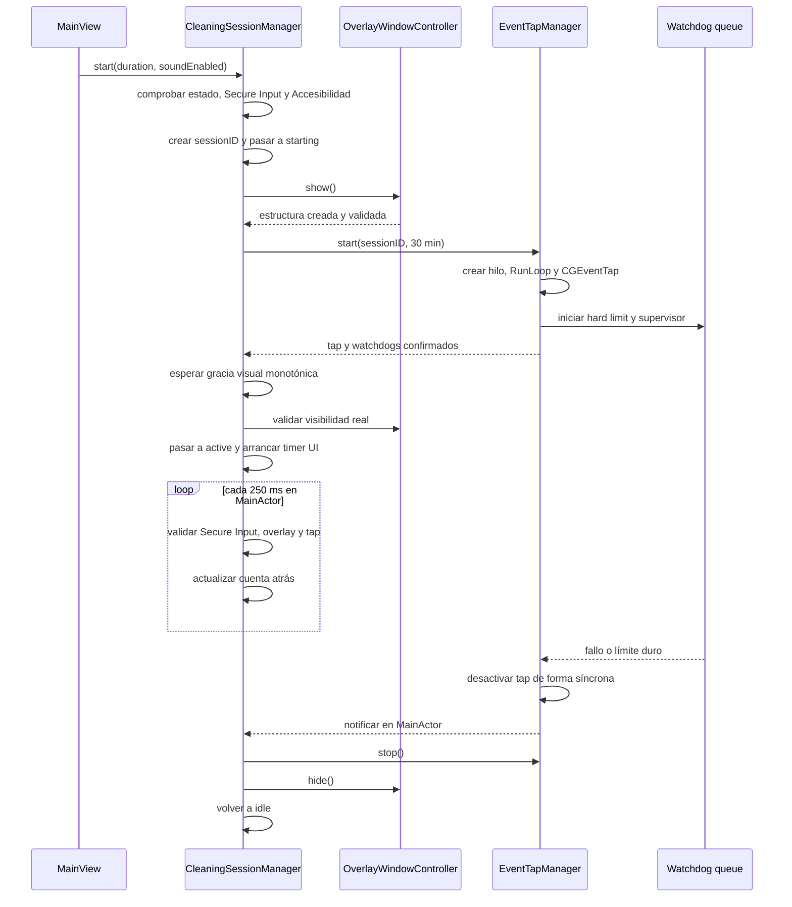
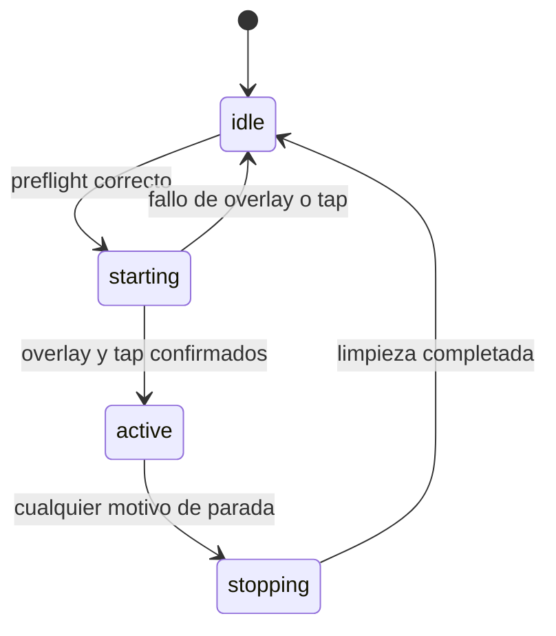

# Arquitectura de Kyboardclean

Este documento describe la implementación real de Kyboardclean v1.0. Su objetivo es permitir que un desarrollador entienda en unos 15 minutos cómo se inicia, supervisa y detiene Cleaning Mode, dónde vive cada responsabilidad y cómo se generan los artefactos de distribución.

## Resumen técnico

- Aplicación nativa macOS escrita en Swift y SwiftUI.
- Deployment target: macOS 14.0.
- Bundle ID: `com.erchosky.Kyboardclean`.
- Un target de aplicación (`Kyboardclean`) y un target de tests (`KyboardcleanTests`).
- Sin dependencias externas.
- Sin App Sandbox (`ENABLE_APP_SANDBOX = NO`).
- Hardened Runtime activado en el proyecto.
- Entitlements vacíos.
- El único permiso comprobado explícitamente es Accesibilidad.
- La captura y descarte de eventos se implementa con un `CGEventTap` de sesión.

La regla central de seguridad es fail-closed: si la app no puede garantizar simultáneamente un overlay válido y un EventTap activo, detiene la sesión y desactiva el tap.

## Estructura del proyecto

```text
Kyboardclean/
├── App/
│   ├── KyboardcleanApp.swift
│   └── AppDelegate.swift
├── Managers/
│   ├── CleaningSessionManager.swift
│   ├── EventTapManager.swift
│   ├── EventTapSupport.swift      (estado del tap, reintentos, sincronización de hilo)
│   ├── EmergencyExit.swift        (atajo de emergencia y secuencia de 5 Escape, lógica pura)
│   ├── OverlayWindowController.swift
│   ├── PermissionsManager.swift
│   └── SoundManager.swift
├── Models/
│   ├── AppSettings.swift
│   ├── AppText.swift
│   ├── CleaningDuration.swift
│   └── CleaningState.swift
├── Views/
│   ├── MainView.swift
│   ├── DurationPicker.swift
│   ├── OverlayView.swift
│   └── SettingsView.swift
└── Resources/
    ├── Assets.xcassets
    ├── en.lproj/Localizable.strings
    ├── es.lproj/Localizable.strings
    ├── Sounds/
    │   ├── activation.wav         (opcional, no incluido en el repositorio)
    │   ├── success.wav            (opcional, no incluido en el repositorio)
    │   └── NOTICE.txt
    ├── Info.plist
    ├── Kyboardclean.entitlements
    └── PrivacyInfo.xcprivacy

KyboardcleanTests/
├── TestSupport.swift              (utilidades compartidas)
├── CleaningSessionTests.swift
├── EventTapTests.swift
├── EmergencyExitTests.swift
├── OverlayTests.swift
├── GlobalShortcutTests.swift
├── ReminderTests.swift
├── CleaningHistoryTests.swift
├── SettingsTests.swift
├── LocalizationTests.swift
└── SystemIntegrationTests.swift

Scripts/
├── lib/common.sh
├── build_release.sh
├── build_dmg.sh
├── build_zip.sh
└── build_source_zip.sh
```

### Responsabilidades

| Componente | Responsabilidad real |
| --- | --- |
| `KyboardcleanApp` | Crea las escenas de ventana, Ajustes y barra de menús, inyecta los objetos compartidos y define los comandos. |
| `AppDelegate` | Registra eventos de ciclo de vida y detiene Cleaning Mode ante suspensión, apagado de pantalla, cierre de sesión o apagado del sistema. |
| `MainView` | Presenta estado, duración, errores y acción de inicio. |
| `SettingsView` | Agrupa General, Automatización y Actividad en el panel nativo de Ajustes. |
| `GlobalShortcutManager` | Registra mediante Carbon un único atajo global configurable y persistente. |
| `ReminderManager` | Gestiona la frecuencia persistente y una notificación local repetitiva mediante `UserNotifications`. |
| `CleaningHistoryStore` | Persiste localmente hasta 500 resultados de sesión y calcula estadísticas derivadas. |
| `CleaningSessionManager` | Orquesta el flujo completo y es la fuente de verdad del estado observable. |
| `EventTapManager` | Crea, ejecuta, supervisa, reactiva y destruye el `CGEventTap`. |
| `OverlayWindowController` | Crea una ventana de overlay por pantalla y valida que todas sigan siendo seguras. |
| `PermissionsManager` | Consulta Accesibilidad y abre el panel correspondiente de Ajustes del Sistema. |
| `SoundManager` | Carga una vez, retiene y reproduce de forma no bloqueante los sonidos locales de activación y finalización correcta. |
| `AppSettings` | Persiste preferencias en `UserDefaults`. |
| `AppText` | Resuelve localización ES/EN y formatea duraciones, errores y motivos de parada. |

`AppSettings`, `PermissionsManager`, `CleaningSessionManager`, `OverlayWindowController` y `SoundManager` están aislados en `MainActor`. `EventTapManager` no lo está: protege su estado compartido con locks y envía a MainActor únicamente las notificaciones que afectan a la sesión o a la UI.

## Objetos compartidos y arranque

`KyboardcleanApp` crea seis `StateObject` a partir de singletons:

- `PermissionsManager.shared`
- `AppSettings.shared`
- `CleaningSessionManager.shared`
- `CleaningHistoryStore.shared`
- `GlobalShortcutManager.shared`
- `ReminderManager.shared`

Los objetos se inyectan únicamente en las escenas que los consumen. Al aparecer la vista principal, `CleaningSessionManager.refreshPreflightStatus()` actualiza Accesibilidad y Secure Event Input.

`AppDelegate` establece la política de activación regular, activa atajo y recordatorios, y registra observadores en `NSWorkspace.shared.notificationCenter`. La última ventana cerrada termina la aplicación salvo que el icono de barra esté insertado o el atajo global esté realmente registrado; un atajo en conflicto no mantiene la app abierta en segundo plano. `applicationWillTerminate` llama de nuevo a `stop(reason: .appTerminated)`; la parada es idempotente.

La escena principal usa `Window` con id estable `main`, por lo que solo existe una instancia. SwiftUI/AppKit persiste de forma nativa tamaño, posición y pantalla bajo `NSWindow Frame main`; al desaparecer una pantalla, AppKit recoloca el marco dentro de una pantalla disponible. Ajustes conserva su propio identificador y los overlays no participan en esta restauración.

## Flujo completo de Cleaning Mode



### Inicio

`CleaningSessionManager.start(duration:soundEnabled:)` ejecuta estos pasos:

1. Rechaza la petición si el estado ya está ocupado (`starting`, `active` o `stopping`).
2. Refresca Accesibilidad y Secure Event Input.
3. Si Secure Event Input está activo, deja la sesión en `idle` y publica `.secureEventInput`.
4. Si falta Accesibilidad, deja la sesión en `idle` y publica `.accessibilityRequired`.
5. Limpia el error y motivo de parada anteriores.
6. Incrementa `currentSessionID` y pasa a `.starting`.
7. Instala callbacks del EventTap capturando ese `sessionID`.
8. Conserva la duración solicitada y arma un límite provisional de 30 minutos para proteger también el arranque; todavía no crea el deadline lógico de limpieza.
9. Muestra primero el overlay y exige que `isStructurallyValid` sea verdadero.
10. Solicita el arranque del EventTap en una cola serial fuera de MainActor. El worker espera como máximo dos segundos a que su hilo confirme la creación, sin congelar la interfaz.
11. Recibe el resultado en MainActor y verifica de nuevo que el `sessionID` siga vigente.
12. Mantiene `.starting` durante una gracia visual escalonada de 100, 150 y 150 ms.
13. Exige entonces que `isVisuallyValid` sea verdadero. Una lectura válida reinicia la histéresis; tres fallos consecutivos cancelan el arranque.
14. Al confirmar `.active`, crea desde ese instante los deadlines monotónicos solicitado y duro, actualiza el watchdog independiente, reproduce sonido si corresponde y crea el timer de sesión.

El timer de sesión se añade a `RunLoop.main` en modo `.common`, repite cada 250 ms y usa un target débil hacia el manager. Publica los segundos redondeados únicamente cuando cambia el valor visible.

### Supervisión durante la sesión

Cada tick del timer de MainActor comprueba, en este orden:

1. Que Secure Event Input no esté activo.
2. Una vez por segundo, que el overlay siga siendo visualmente válido.
3. El estado thread-safe del EventTap: exige `.running`, tolera `.reactivating` durante un máximo de dos segundos y detiene ante `.failed`, un estado inesperado o una reactivación vencida.
4. Que no haya vencido el deadline monotónico de la duración solicitada.

Además existen watchdogs fuera de MainActor, descritos más adelante.

### Parada

Todas las rutas terminan en `CleaningSessionManager.stop(reason:)`:

1. Si la sesión ya no está ocupada, vuelve a pedir la parada del tap, limpia el callback del overlay y oculta ventanas. Esto hace la operación idempotente.
2. Si ya está en `.stopping`, no repite el trabajo.
3. Cambia a `.stopping(reason:)`.
4. Invalida el timer y libera su target.
5. En cancelaciones, errores y salidas urgentes, desactiva el EventTap y después oculta los overlays inmediatamente.
6. Solo `.timerFinished` conserva durante 450 ms tanto el overlay como el EventTap activo para presentar el cierre visual sin que la entrada atraviese la ventana. Después desactiva el tap y oculta el overlay, en ese orden. Una salida urgente interrumpe esa espera.
7. Reinicia contadores y deadlines monotónicos.
8. Publica un `errorCode` o un `lastStopReason`, según el motivo.
9. Vuelve a `.idle` y reproduce el sonido final si la sesión llegó a estar activa.

Las rutas actuales de parada incluyen temporizador, límite duro, atajos de emergencia, fallo del tap, pérdida de permiso, Secure Event Input, overlay no válido, suspensión/cambio de sesión y terminación de la app.

## Estado y generación de sesión

`CleaningState` tiene cuatro estados:



- `idle`: no hay sesión activa.
- `starting`: preflight superado, pero overlay y tap todavía se están confirmando.
- `active`: overlay, EventTap y watchdogs confirmados.
- `stopping(reason:)`: evita dobles paradas mientras se desmontan recursos.

Cada inicio válido incrementa un `UInt64` monotónico mediante suma con overflow (`&+=`). Los callbacks capturan el valor de su sesión. Tanto `CleaningSessionManager` como `EventTapManager` validan ese token antes de actuar; un callback retrasado de una sesión anterior no puede detener una sesión nueva.

`StopReason` representa por qué terminó una sesión. `SessionErrorCode` representa errores mostrables y se traduce mediante claves de `Localizable.strings`; la lógica no depende de comparar textos localizados.

## EventTap

### Creación y ownership

`EventTapManager.start` asigna una generación de petición y despacha el trabajo a la cola serial `Kyboardclean.EventTapStartup`. Allí detiene cualquier instancia anterior, crea un `Thread` llamado `Kyboardclean.EventTap` y ejecuta un RunLoop propio. El resultado vuelve mediante un callback `@MainActor`; la llamada desde la UI no espera. El hilo:

1. Obtiene su `CFRunLoop`.
2. Crea un `CGEventTap` con:
   - tap: `.cgSessionEventTap`
   - posición: `.headInsertEventTap`
   - opciones: `.defaultTap`
3. Crea y añade un `CFRunLoopSource` en `.commonModes`.
4. Activa el tap y confirma que realmente quedó habilitado.
5. Ejecuta `CFRunLoopRun()`.

El callback no toca UI. Solo clasifica el evento, actualiza estado protegido o agenda una notificación posterior en MainActor.

### Máscara y tratamiento de eventos

La máscara incluye:

- `keyDown`, `keyUp`, `flagsChanged`
- botones izquierdo, derecho y otros: down/up
- `mouseMoved`
- drag izquierdo, derecho y otros
- `scrollWheel`
- el bit raw 14 para eventos `systemDefined`

Los eventos de teclado y ratón incluidos se descartan devolviendo `nil`. Esto incluye movimiento y clics: durante Cleaning Mode no existe una zona de ratón especial para detener la sesión.

Excepciones y salidas:

- `Command + Option + Escape` se deja pasar para conservar el acceso al Force Quit de macOS.
- `Control + Option + Command + Escape` desactiva el tap de forma síncrona en el hilo del tap y después notifica la parada.
- Cinco `keyDown` de Escape dentro de una ventana de tres segundos hacen lo mismo.
- El auto-repeat de teclado se ignora antes de contar Escape.
- Los eventos `systemDefined` recibidos se descartan.
- Un tipo no contemplado por el switch se deja pasar.

No se llama a `CGEventKeyboardGetUnicodeString`, no se convierten teclas a texto y no se almacenan secuencias. Para Escape solo se conservan temporalmente timestamps monotónicos protegidos por `escapeLock`.

### Reactivación

Si CoreGraphics entrega `tapDisabledByTimeout` o `tapDisabledByUserInput`, el manager pasa a `.reactivating` e intenta reactivar el tap siempre que la sesión siga vigente, no esté parando y no haya sido desarmada por emergencia. El supervisor de sesión distingue este estado de un fallo definitivo y solo lo tolera dentro de una ventana monotónica de dos segundos.

El límite es de tres fallos consecutivos. Los retrasos son 100, 200 y 300 ms. La espera ocurre en la cola de watchdog y la reactivación real se agenda en el RunLoop del hilo del tap. Si el tap permanece válido y habilitado durante 250 ms, el contador vuelve a cero. Cada intento lleva una generación propia para que una confirmación antigua no reinicie un intento posterior. Si se agotan los intentos o la reactivación falla, el tap se desactiva y se notifica `.eventTapFailed`.

### Destrucción

La parada pública no bloquea MainActor esperando al hilo. De forma síncrona:

- cancela watchdogs;
- marca `isStopping` y `emergencyDisarmed`;
- invalida el `sessionID` activo;
- desactiva el tap si existe.

Después agenda en el RunLoop del tap la retirada de la source, la invalidación del `CFMachPort` y la parada del RunLoop. Cada generación del hilo tiene un único `TapThreadCompletion`, basado en `DispatchGroup`: todos los callers que necesiten esperar reutilizan esa finalización y el hilo la completa una sola vez. Solo el worker de la cola de arranque puede esperar hasta dos segundos a que termine un tap anterior o a que el hilo nuevo confirme su resultado. `startRequestGeneration` invalida workers antiguos ante stop o start-stop-start rápido.

`lifecycleLock` protege tap, RunLoop, hilo, flags, generación y timers. `escapeLock` protege exclusivamente los timestamps de Escape. `callbackLock` protege la instalación, lectura y limpieza de las closures que notifican a MainActor, incluida la parada concurrente.

## Overlay

`OverlayWindowController` está aislado en MainActor. `show()` desmonta cualquier overlay anterior y crea una `OverlayWindow` por cada elemento de `NSScreen.screens`.

Cada ventana es:

- borderless y del tamaño exacto de la pantalla;
- de nivel `.screenSaver`;
- transparente, sin sombra y con `OverlayView` alojada en `NSHostingView`;
- receptora de eventos de ratón (`ignoresMouseEvents = false`);
- compatible con todos los Spaces y fullscreen auxiliar;
- excluida del ciclo normal de ventanas.

`isStructurallyValid`, usado inmediatamente al arrancar, exige que:

- `isPresenting` sea verdadero;
- exista al menos una pantalla;
- haya exactamente una ventana por pantalla;
- cada pantalla tenga una ventana con nivel `.screenSaver`, content view, alpha positivo, ratón habilitado, comportamiento de Spaces requerido y frame equivalente al de la pantalla con tolerancia de 1 punto.

Esta validación no consulta inmediatamente `occlusionState` ni `isOnActiveSpace`, porque AppKit puede no haber actualizado esos valores en el mismo ciclo de RunLoop que presenta la ventana.

`isVisuallyValid`, usado tras una gracia total de 400 ms y periódicamente durante la sesión, añade:

- ventana visible y no minimizada;
- `occlusionState` visible;
- pertenencia al Space activo;
- cobertura de cada pantalla actual con tolerancia de 1 punto.

Durante el arranque se requieren tres fallos visuales consecutivos para cancelar; durante una sesión activa se requieren dos lecturas fallidas consecutivas. Cualquier lectura válida reinicia el contador.

Un cambio de parámetros de pantalla dispara `NSApplication.didChangeScreenParametersNotification`. La implementación actual no reconstruye overlays durante una sesión: llama a `onOverlayUnavailable`, lo que detiene Cleaning Mode y desmonta el tap antes de continuar. Es una decisión fail-closed.

`OverlayView` solo presenta estado, temporizador y rutas de salida por teclado/tiempo. Usa transiciones finitas ligadas al estado y sustituye escala, spring y trazo del check por opacidad cuando Reduce Motion está activo. Los clics son descartados globalmente por el EventTap.

## Watchdogs y temporizadores

Existen tres mecanismos distintos:

| Mecanismo | Contexto | Cadencia | Función |
| --- | --- | --- | --- |
| Hard watchdog | `DispatchSourceTimer` en `Kyboardclean.EventTapWatchdog` | Una vez, desde el arranque y reajustado al confirmar `.active` | Desactiva el tap directamente y notifica el límite duro. Usa `DispatchTime`. En una sesión temporizada de 30 minutos admite un margen interno de un segundo para que el check final de 450 ms termine protegido; el deadline lógico sigue siendo exactamente 30 minutos. |
| Safety supervisor | `DispatchSourceTimer` en la misma cola serial | Primer check a 250 ms; después cada 500 ms | Comprueba Secure Event Input y Accesibilidad. Ante fallo desactiva el tap antes de notificar MainActor. |
| Session timer | `Timer` en RunLoop.main `.common` | Cada 250 ms | Valida el tap, aplica el deadline solicitado y actualiza UI; valida el overlay visual una vez por segundo. |

El hard watchdog y el supervisor capturan `sessionID`. Si pertenecen a una sesión anterior, `disableTapSynchronously` rechaza su acción.

La comprobación independiente no valida ventanas porque `NSScreen` y `NSWindow` pertenecen a AppKit/MainActor. La validez del overlay se comprueba tras la gracia de arranque y después una vez por segundo. Tanto la duración solicitada como el límite duro usan `DispatchTime`; el límite duro y la desactivación de tap no dependen de MainActor.

## Permisos y Secure Event Input

`PermissionsManager` consulta `AXIsProcessTrusted()` y solo publica cambios reales. `requestAccessibility()` llama a `AXIsProcessTrustedWithOptions` con prompt como máximo una vez por proceso. Después, el CTA secundario puede abrir directamente `Privacy_Accessibility`; si esa URL falla, abre el panel general de Privacidad y seguridad. Volver la app a primer plano refresca el estado sin volver a solicitar permiso automáticamente.

La app no declara permisos en `Kyboardclean.entitlements`; el archivo está vacío. Tampoco activa App Sandbox. `Info.plist` prohíbe múltiples instancias con `LSMultipleInstancesProhibited`.

Secure Event Input no es un permiso concedido a la app. Se consulta con `IsSecureEventInputEnabled()`:

- antes de iniciar;
- en el supervisor independiente cada 500 ms.

Si está activo, la app no inicia o desarma y detiene una sesión existente porque macOS puede no entregar las teclas al EventTap.

`PrivacyInfo.xcprivacy` declara que no hay tracking, dominios de tracking ni datos recopilados. También declara los motivos obligatorios `CA92.1` para preferencias propias en `UserDefaults` y `35F9.1` para tiempo monotónico usado en temporizadores y medición de intervalos; esa información no sale del dispositivo.

## Ajustes, localización y sonidos

`AppSettings` persiste en `UserDefaults`:

- sonido activado/desactivado;
- modo de duración;
- segundos de duración personalizada;
- idioma automático, español o inglés;
- apariencia Sistema, Claro u Oscuro.

La presencia opcional en la barra usa `@AppStorage` con la misma base `UserDefaults`. `GlobalShortcutManager`, `ReminderManager` y `CleaningHistoryStore` son propietarios de sus propias claves para, respectivamente, combinación/estado del atajo, frecuencia y sesiones locales (UUID, fecha, duración y resultado).

Las duraciones temporizadas se limitan entre 10 y 1.800 segundos. El modo manual no tiene deadline solicitado, pero conserva el mismo hard limit de 30 minutos.

`AppText` carga `Localizable.strings` de español o inglés. El modo automático selecciona una localización soportada del bundle y usa inglés como fallback. El locale efectivo se inyecta en la escena SwiftUI y en el overlay; las vistas siguen observando `AppSettings.languageMode`, por lo que cambian sin reiniciar la sesión. Los elementos estándar propiedad de AppKit siguen el idioma de macOS, y el contenido de `Info.plist` se traduce mediante `InfoPlist.strings`.

`SoundManager` precarga y mantiene en caché dos `NSSound` locales. `play(_:)` inicia reproducción asíncrona de AppKit y vuelve inmediatamente; no crea timers, loops ni trabajo de audio continuo. La activación usa `activation.wav` y solo una finalización normal del temporizador usa `success.wav`. Si falta un recurso, el fallo es silencioso y no afecta a la sesión.

Los dos recursos proceden de SND01 "sine" de Yasuhiro Tsuchiya. Sus términos permiten integrarlos en aplicaciones comerciales y no comerciales, pero prohíben redistribuir el material crudo por separado. `Resources/Sounds/NOTICE.txt` conserva origen, nombres originales y enlace a los términos.

El atajo global usa `RegisterEventHotKey` de Carbon. El callback solo salta a MainActor y reutiliza `CleaningSessionManager.startFromUserAction`; no duplica el flujo de inicio. La barra de menús reutiliza la misma entrada y `AppSettings.selectedDurationMode`.

`ReminderManager` solicita autorización nativa únicamente cuando el usuario elige una frecuencia. La frecuencia persistida representa la intención del usuario; `authorizationState` e `isScheduleActive` describen por separado si existe programación efectiva. Denegación o fallo de alta cancelan la solicitud efectiva sin convertir la preferencia en Nunca. Un gate asíncrono serializa cancelación y alta para que una operación antigua no pueda reaparecer después de desactivar o cambiar la frecuencia. La opción rotulada Cada 30 días usa deliberadamente un intervalo fijo, no semántica mensual de calendario.

`CleaningHistoryStore` no guarda eventos de entrada: registra una fila solo tras alcanzar `.active`, mide hasta el instante en que se solicita la parada (sin incluir la animación final), normaliza duraciones al límite duro, deduplica IDs antiguos y conserva 500 filas. El historial puede mostrar completadas y canceladas, pero las estadísticas de limpiezas, tiempo total, media y última limpieza se derivan exclusivamente de sesiones completadas.

`GlobalShortcutManager` conserva estados separados para desactivado, activo, combinación inválida, conflicto Carbon, fallo al instalar el handler y fallo de registro. Las teclas especiales se representan por keycode estable (flechas, F1-F20, Space, Tab, Return, Delete y navegación), sin convertir secuencias escritas a texto. Space solo es válido con al menos dos modificadores admitidos.

## Ciclo de vida del sistema

`AppDelegate` solicita una parada con `.systemEvent` ante:

- `NSWorkspace.willSleepNotification`
- `NSWorkspace.screensDidSleepNotification`
- `NSWorkspace.sessionDidResignActiveNotification`
- `NSWorkspace.willPowerOffNotification`

Al volver la app a primer plano, refresca Accesibilidad y Secure Event Input. Al terminar la aplicación, solicita una última parada, elimina observadores y deja que `EventTapManager.stop()` desactive el tap de forma idempotente.

Un cierre forzado externo (`kill -9`) o un crash del proceso no ejecuta código de cleanup; el EventTap pertenece al proceso y macOS lo elimina al finalizar dicho proceso.

La retirada visual del overlay requiere MainActor/AppKit. No hay waits síncronos, I/O ni trabajo pesado propio en las rutas de sesión del actor, y `EventTapManager.stop()` puede desarmar el tap desde otro hilo aunque MainActor esté temporalmente ocupado. Si MainActor quedara bloqueado indefinidamente, la app no puede retirar una `NSWindow` desde el callback de CoreGraphics de forma segura; resolver ese caso exigiría un helper externo y queda fuera de la arquitectura v1.0. `Command + Option + Escape` se deja pasar y terminar el proceso hace que macOS retire tanto sus ventanas como su EventTap.

## Tests

`KyboardcleanTests` no intenta crear un EventTap real. Cubre lógica determinista:

- clamp de duraciones y presets;
- modo manual y duración personalizada;
- estados busy/stopping;
- rechazo de generaciones antiguas;
- arranque asíncrono, fallo, cancelación durante arranque y start-stop-start rápido;
- timeout y múltiples waiters de finalización del hilo;
- stops concurrentes y terminación de la app durante `.starting`;
- validación estructural con tolerancia, gracia visual, histéresis y ventana oculta;
- callback obsoleto de cambio de pantalla;
- flujo de solicitud única de Accesibilidad;
- persistencia aislada de apariencia;
- persistencia del atajo global;
- validación y representación del atajo;
- frecuencias, autorización y scheduling de recordatorios;
- orden, límite, persistencia y estadísticas del historial;
- 1.000 ciclos de generación y start/stop simulado de EventTap;
- 1.000 ciclos de estado start/stop;
- 100 ciclos de registro/desregistro de atajo y cambios de recordatorio;
- 1.000 escrituras de historial con borrado repetido;
- idempotencia de stop;
- parada por overlay no disponible;
- bloqueo de inicio por Secure Event Input;
- publicaciones de cuenta atrás;
- deadline monotónico de la duración solicitada;
- inicio del deadline únicamente al confirmar `.active`, incluido arranque lento o reintentado;
- estados y límite temporal de reactivación del EventTap;
- estadísticas basadas exclusivamente en sesiones completadas;
- conservación de frecuencia de recordatorio ante denegación, fallo y cambio de idioma;
- estados de error Carbon y keycodes especiales del atajo global;
- orden protegido EventTap-antes-de-overlay tras los 450 ms de finalización;
- desarme del EventTap mientras MainActor está temporalmente bloqueado;
- prioridad `timerFinished` para una duración elegida de 30 minutos;
- múltiples waiters sobre una única finalización del hilo;
- mapeo explícito de `.unsafeState`;
- regresión de strings con `%`.

Los helpers usados por estos tests están compilados únicamente bajo `#if DEBUG`.

## Scripts de distribución

Todos los scripts usan `set -euo pipefail`, crean temporales mediante `mktemp -d` y registran cleanup con `trap`.

`Scripts/lib/common.sh` centraliza `require_command`, creación y limpieza restringida de temporales, limpieza de metadatos de bundles y verificación estricta de firma. Los cuatro scripts cargan esta librería después de calcular `ROOT_DIR`.

### `Scripts/build_release.sh`

1. Compila Release con `xcodebuild` en DerivedData temporal.
2. Fuerza `ONLY_ACTIVE_ARCH=NO` y `ARCHS="arm64 x86_64"`.
3. Copia `Kyboardclean.app` a `dist/`.
4. Elimina `.DS_Store`, atributos extendidos y FinderInfo.
5. Si encuentra un certificado `Developer ID Application`, firma el bundle raíz con hardened runtime, timestamp y los entitlements vacíos. Si el timestamp falla, reintenta sin timestamp para uso local.
6. Si no encuentra certificado, conserva la firma local generada por Xcode.
7. Ejecuta `codesign --verify --strict` y rechaza cualquier Release que contenga `com.apple.security.get-task-allow`.

No usa `codesign --deep` y no firma componentes anidados de forma explícita porque la implementación actual no contiene frameworks ni helper tools propios.

### `Scripts/build_dmg.sh`

Requiere `dist/Kyboardclean.app`. Copia la app sin atributos extendidos a un directorio temporal, añade un symlink a `/Applications`, limpia metadatos, verifica la firma y crea `dist/Kyboardclean.dmg` en formato comprimido `UDZO`.

### `Scripts/build_zip.sh`

Requiere `dist/Kyboardclean.app`. Crea `dist/Kyboardclean.app.zip` con `zip -X`, lo extrae en un directorio temporal y verifica con firma estricta tanto la copia extraída como la app original.

### `Scripts/build_source_zip.sh`

Crea `dist/Kyboardclean_Source.zip` mediante una copia temporal con `rsync`. Excluye Git, `dist`, DerivedData, `.build`, `.swiftpm`, datos de usuario de Xcode, logs, cachés, temporales, binarios, apps, DMG, ZIP y módulos compilados.

## Release

El orden normal es:

```bash
Scripts/build_release.sh
Scripts/build_dmg.sh
Scripts/build_zip.sh
Scripts/build_source_zip.sh
```

Artefactos esperados:

```text
dist/Kyboardclean.app
dist/Kyboardclean.dmg
dist/Kyboardclean.app.zip
dist/Kyboardclean_Source.zip
```

La versión actual de `Info.plist` es 1.0, build 1. El proyecto no fija `DEVELOPMENT_TEAM`, por lo que puede compilarse localmente con Xcode y firma local.

Los scripts no ejecutan notarización ni stapling. Para distribución pública fuera de App Store hacen falta un certificado Developer ID Application válido, firma con timestamp, envío a notarización de Apple y stapling del ticket. Sin eso, DMG/ZIP son artefactos para uso personal o distribución privada y Gatekeeper puede advertir al abrirlos en otro Mac.

## Invariantes que no deben romperse

Al modificar el proyecto, mantener estas condiciones:

1. El overlay debe confirmarse antes de activar el EventTap.
2. No puede permanecer un EventTap activo si el overlay deja de ser válido.
3. Las salidas de emergencia deben desactivar el tap antes de esperar a MainActor.
4. El hard limit debe seguir usando tiempo monotónico fuera de MainActor.
5. Todo callback asíncrono debe validar `sessionID`.
6. `stop()` debe seguir siendo idempotente y no bloquear MainActor esperando al hilo del tap.
7. El callback del EventTap no debe tocar UI, convertir teclas a texto, imprimirlas ni almacenarlas.
8. Secure Event Input o la pérdida de Accesibilidad deben desarmar el tap.
9. Los artefactos finales deben pasar `codesign --verify --strict` después de empaquetarse.

## Comandos de verificación habituales

```bash
xcodebuild -project Kyboardclean.xcodeproj -scheme Kyboardclean -configuration Debug build
xcodebuild -project Kyboardclean.xcodeproj -scheme Kyboardclean -configuration Release build
xcodebuild -project Kyboardclean.xcodeproj -scheme Kyboardclean analyze
xcodebuild -project Kyboardclean.xcodeproj -scheme Kyboardclean test
```

Para entender un fallo de Cleaning Mode, el orden de lectura recomendado es:

1. `CleaningSessionManager.swift`
2. `EventTapManager.swift`
3. `OverlayWindowController.swift`
4. `CleaningState.swift`
5. `AppDelegate.swift`
